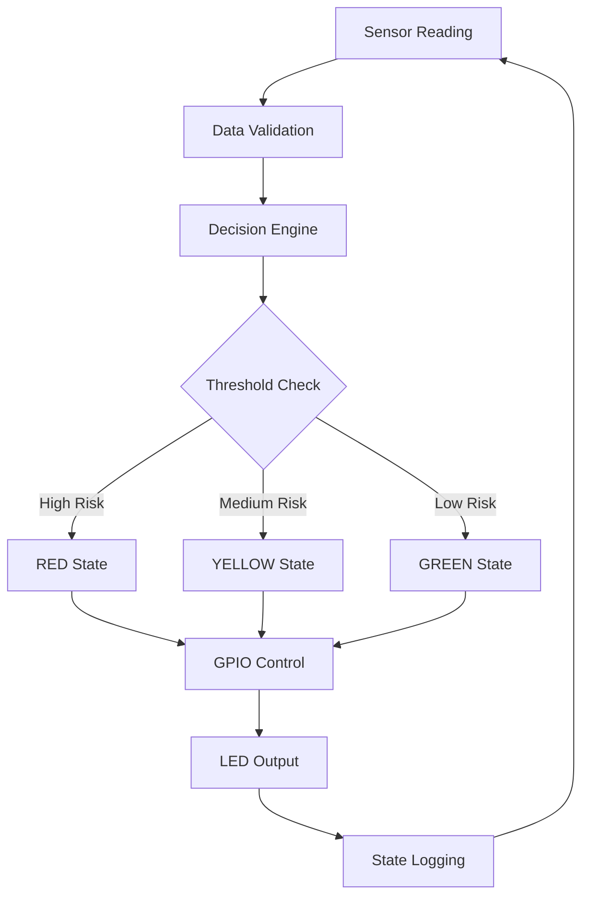

# 🏗️ Architecture Guide - Mental Focus Desk Lamp


## 🎯 Architecture Overview

This project demonstrates professional IoT system architecture principles through a well-structured, modular design that can scale from educational prototypes to production systems.

---

## 🏛️ System Architecture

### **Layered Architecture Pattern**
```
┌─────────────────────────────────────┐
│           Application Layer          │
│              (main.py)              │
├─────────────────────────────────────┤
│          Business Logic Layer       │
│         (controllers/)              │
├─────────────────────────────────────┤
│           Data Access Layer         │
│            (sensors/)               │
├─────────────────────────────────────┤
│         Hardware Abstraction        │
│             (stubs/)                │
└─────────────────────────────────────┘
```

---

## 📦 Component Architecture

### **1. Sensor Layer** 


**Purpose**: Data acquisition and processing
**Design Pattern**: Factory Pattern + Observer Pattern

```python
# Standardized sensor interface
class SensorInterface:
    def read_value(self) -> int:
        pass

# Concrete implementations
class NoiseSensor(SensorInterface)
class LightSensor(SensorInterface)  
class HeartbeatSensor(SensorInterface)
```

**Benefits**:
- ✅ Uniform interface across all sensors
- ✅ Easy to add new sensor types
- ✅ Testable with mock implementations
- ✅ Hardware-agnostic design

### **2. Controller Layer**


**Purpose**: Business logic and decision making
**Design Pattern**: Strategy Pattern + State Machine

```python
class LampController:
    def update(self, noise: int, light: int, heartbeat: int):
        # Multi-criteria decision engine
        # State management
        # Hardware control abstraction
```

**Benefits**:
- ✅ Centralized decision logic
- ✅ Configurable thresholds
- ✅ State tracking and management
- ✅ Hardware abstraction

### **3. Hardware Abstraction Layer**


**Purpose**: Hardware interface simulation
**Design Pattern**: Facade Pattern + Adapter Pattern

```python
# GPIO abstraction
class Gpio:
    def dir(self, mode: int): pass
    def write(self, value: int): pass

# Sensor base abstraction  
class Sensor:
    def read_value(self): pass
```

**Benefits**:
- ✅ Hardware-independent development
- ✅ Easy testing without hardware
- ✅ Platform portability
- ✅ Cost-effective prototyping

### **4. Application Layer**


**Purpose**: System orchestration and user interface
**Design Pattern**: MVC Pattern + Observer Pattern

```python
def main():
    # Component initialization
    # Main execution loop
    # User interaction handling
    # System monitoring
```

---

## 🔄 Data Flow Architecture

### **Sensor Data Pipeline**
```
Sensors → Read Values → Controller → Decision Engine → GPIO Output
   ↓           ↓            ↓           ↓              ↓
Random      int[3]      Update()    State Logic    LED Control
Values   [noise,light,  Method     [RED,YELLOW,    Pin Control
         heartbeat]                  GREEN]
```

### **Control Flow Diagram**


---

## 🎨 Design Patterns Implementation

### **1. Factory Pattern** 


**Usage**: Sensor creation and configuration

```python
class SensorFactory:
    @staticmethod
    def create_sensor(sensor_type: str):
        if sensor_type == "noise":
            return NoiseSensor()
        elif sensor_type == "light":
            return LightSensor()
        elif sensor_type == "heartbeat":
            return HeartbeatSensor()
```

**Benefits**:
- Centralized object creation
- Easy configuration management
- Loose coupling between components

### **2. Strategy Pattern**


**Usage**: Decision algorithm implementation

```python
class DecisionStrategy:
    def evaluate(self, sensors: dict) -> str:
        pass

class ConservativeStrategy(DecisionStrategy):
    # Lower thresholds, more sensitive

class AggressiveStrategy(DecisionStrategy):  
    # Higher thresholds, less sensitive
```

### **3. Observer Pattern**


**Usage**: State change notifications

```python
class StateObserver:
    def on_state_change(self, old_state: str, new_state: str):
        pass

class LoggingObserver(StateObserver):
    # Log state changes
    
class AlertObserver(StateObserver):
    # Send notifications
```

### **4. Facade Pattern**


**Usage**: Hardware complexity hiding

```python
class HardwareFacade:
    def __init__(self):
        self.gpio_controller = GpioController()
        self.sensor_manager = SensorManager()
    
    def initialize_system(self):
        # Complex initialization hidden
        pass
```

---

## 🔧 Configuration Architecture

### **Configuration Management**
```python
# config.py
class Config:
    # Sensor thresholds
    NOISE_RED_THRESHOLD = 70
    NOISE_YELLOW_THRESHOLD = 50
    
    # GPIO pin assignments
    RED_LED_PIN = 11
    GREEN_LED_PIN = 12
    YELLOW_LED_PIN = 13
    
    # System settings
    UPDATE_INTERVAL = 1.0
    ENABLE_LOGGING = True
```

**Benefits**:
- ✅ Centralized configuration
- ✅ Environment-specific settings
- ✅ Easy threshold tuning
- ✅ Feature flag support

---

## 📈 Scalability Architecture

### **Horizontal Scaling Preparation**
```python
# Message queue integration ready
class MessageBroker:
    def publish_sensor_data(self, data: dict):
        # MQTT, RabbitMQ, or Kafka integration
        pass
    
    def subscribe_to_commands(self, callback):
        # Remote control capability
        pass
```

### **Microservices Architecture (Future)**
```
┌─────────────┐    ┌─────────────┐    ┌─────────────┐
│   Sensor    │    │ Decision    │    │   Control   │
│  Service    │    │  Service    │    │  Service    │
│             │    │             │    │             │
│ ┌─────────┐ │    │ ┌─────────┐ │    │ ┌─────────┐ │
│ │ Noise   │ │    │ │ Rules   │ │    │ │ GPIO    │ │
│ │ Light   │ │    │ │ Engine  │ │    │ │ Control │ │
│ │ Heart   │ │    │ │ ML      │ │    │ │ Status  │ │
│ └─────────┘ │    │ └─────────┘ │    │ └─────────┘ │
└─────────────┘    └─────────────┘    └─────────────┘
       │                   │                   │
       └─────────── API Gateway ──────────────┘
```

---

## 🛡️ Security Architecture

### **Security Considerations**


**Data Protection**:
- Input validation for all sensor data
- Range checking to prevent injection
- Secure communication protocols (future)

**Access Control**:
- Role-based access control (future)
- API authentication (future)
- Audit logging capabilities

**Device Security**:
- Secure boot process (future)
- Encrypted configuration storage (future)
- Over-the-air update security (future)

---

## 🧪 Testing Architecture

### **Test Pyramid Implementation**
```
           ┌─────────────────┐
           │   E2E Tests     │ ← Integration tests
           │   (Few)         │
           ├─────────────────┤
           │ Integration     │ ← Component tests  
           │ Tests (Some)    │
           ├─────────────────┤
           │   Unit Tests    │ ← Isolated tests
           │   (Many)        │
           └─────────────────┘
```

**Testing Layers**:
- **Unit Tests**: Individual component testing
- **Integration Tests**: Component interaction testing  
- **System Tests**: End-to-end functionality testing
- **Performance Tests**: Load and stress testing

---

## 📊 Monitoring & Observability

### **Observability Architecture** (Future Enhancement)
```python
class SystemMonitor:
    def __init__(self):
        self.metrics_collector = MetricsCollector()
        self.logger = StructuredLogger()
        self.tracer = DistributedTracer()
    
    def track_sensor_reading(self, sensor_type: str, value: int):
        # Metrics collection
        # Performance monitoring
        # Anomaly detection
```

**Monitoring Capabilities**:
- ✅ Sensor reading frequency tracking
- ✅ Decision latency measurement
- ✅ State change event logging
- ✅ System health monitoring

---

## 🔮 Future Architecture Evolution

### **Phase 1: Current State**
- Monolithic simulation
- Local execution only
- Console-based interface

### **Phase 2: Enhanced Features**
- Data persistence layer
- Web-based dashboard
- Configuration management

### **Phase 3: IoT Platform**
- Cloud connectivity
- Remote monitoring
- Over-the-air updates

### **Phase 4: AI Integration**
- Machine learning models
- Predictive analytics
- Adaptive behavior

### **Phase 5: Enterprise Scale**
- Multi-tenant architecture
- High availability design
- Global deployment capability

---

## 📚 Architecture Principles Applied

### **SOLID Principles**


- **S**ingle Responsibility: Each class has one clear purpose
- **O**pen/Closed: Easy to extend without modification
- **L**iskov Substitution: Interface implementations are interchangeable
- **I**nterface Segregation: Small, focused interfaces
- **D**ependency Inversion: Depend on abstractions, not concretions

### **IoT Architecture Principles**


- **Modularity**: Separate concerns for maintainability
- **Scalability**: Design for growth and expansion
- **Reliability**: Robust error handling and recovery
- **Security**: Defense in depth approach
- **Testability**: Comprehensive testing strategy

---

**Build It Right! 🏗️✨**
